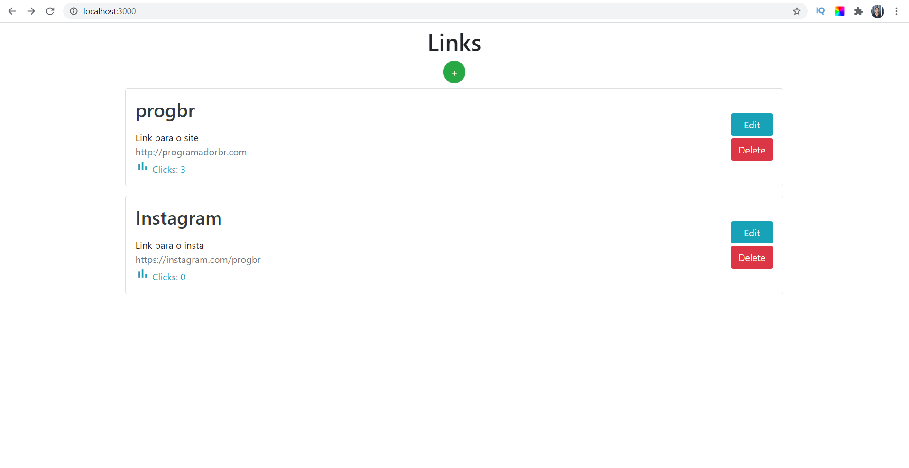
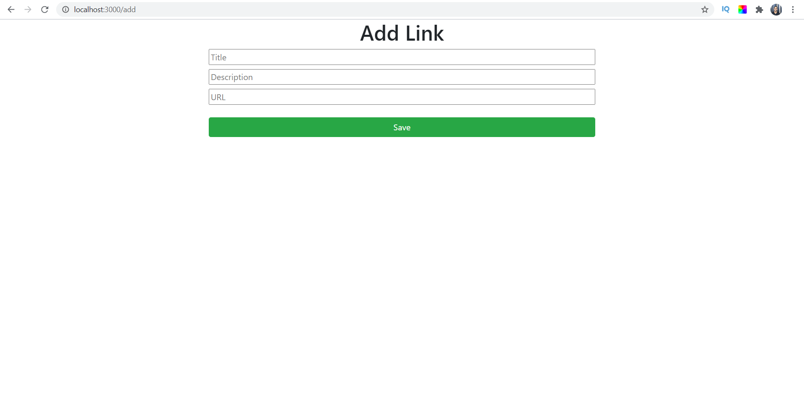
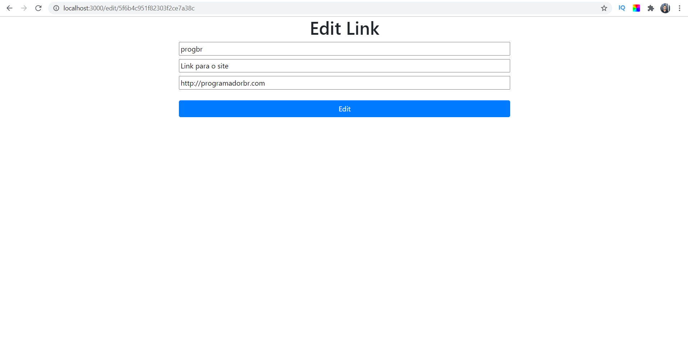
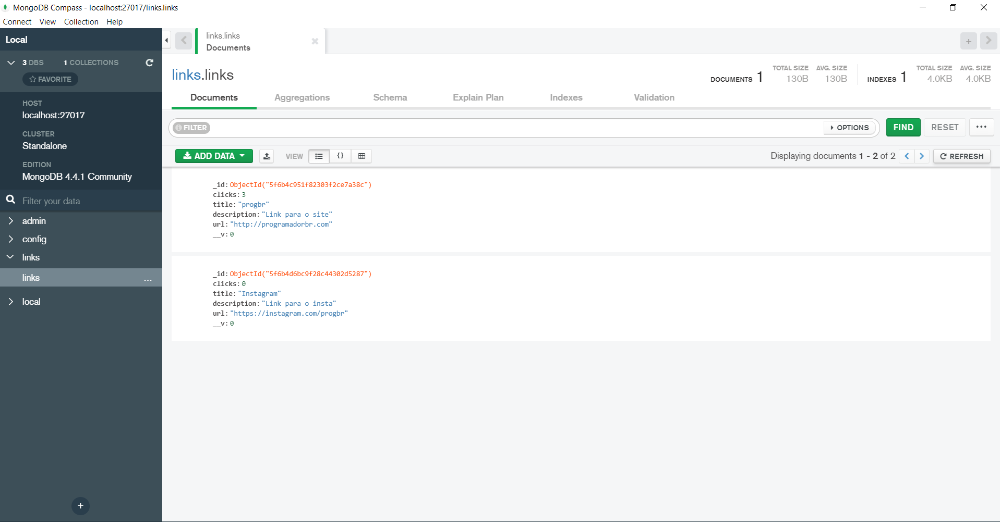

# Projeto Node.Js + MongoDb

Este projeto tem como funcionalidade criar links alternativos para sites e saber quantos clicks foram dados nesse link. Esta aplicação foi pensada para o uso de Afiliados de cursos, para conseguirem criar seus links alternativos e ainda saber se a conversão do tráfego está boa.

Utilizando MongoDb para gerenciar os dados e o Node.Js para  desenvolver todo o Back-End da aplicação.

O Front-End desta aplicação foi apenas HTML e Bootstrap.

## Tela Inicial

## Add Link

## Edit Link

## MongoDb

